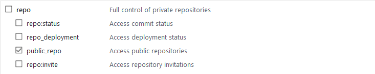

# gatsby-source-github-pinned

Source plugin for pulling pinned repositories into Gatsby from the GitHub GraphQL API.

## Install

`npm install --save gatsby-source-github-pinned`

## How to use

### Create API Token

You first need to go [here](https://github.com/settings/tokens/new) and generate a read-only api token for your repositories:



Make sure to ONLY check the **puclic_repo** option.

### Setup Gatsby

```javascript
// In your gatsby-config.js
plugins: [
  {
    resolve: `gatsby-source-github-pinned`,
    options: {
      apiToken: `YOUR_READONLY_API_TOKEN`
    }
  }
];
```

## How to query

Get the name and url of all pinned repos:

```graphql
query PinnedRepos {
  allPinnedRepo {
    edges {
      node {
        name
        url
      }
    }
  }
}
```
